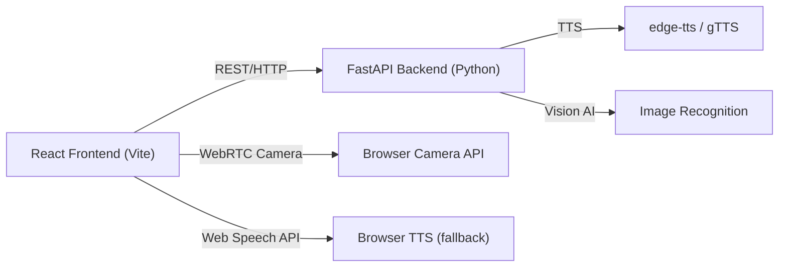

# Aquel Bridge — Implementation Plan

A communication bridge for AAC (Augmentative & Alternative Communication) users. People who communicate using **symbols/pictures** can build sentences that are spoken aloud using text-to-speech, enabling fluid communication with speech users.

## Architecture Overview



**Project Location**: `c:\Users\_d_av1d_\project1\aquel_bridge`

---

## Proposed Changes

### Backend — Python FastAPI

#### [NEW] `backend/` directory structure
```
backend/
├── main.py              # FastAPI app entry point
├── routers/
│   ├── tts.py           # Text-to-speech endpoint
│   ├── symbols.py       # Symbol library CRUD
│   └── recognize.py     # Camera image recognition
├── services/
│   ├── tts_service.py   # TTS logic (edge-tts)
│   └── vision_service.py # Image description via AI
├── data/
│   └── symbols.json     # Default AAC symbol library
└── requirements.txt
```

**Key endpoints:**
| Method | Path | Description |
|--------|------|-------------|
| `POST` | `/api/speak` | Convert text → audio file stream |
| `GET` | `/api/symbols` | Return symbol library |
| `POST` | `/api/recognize` | Upload camera frame → get description |
| `GET` | `/api/audio/{filename}` | Serve generated audio |

**Python packages:**
- `fastapi`, `uvicorn` — web server
- `edge-tts` — high-quality TTS (Microsoft voices, free)
- `Pillow` — image handling
- `python-multipart` — file uploads
- `httpx` — async http (for AI vision if needed)

---

### Frontend — React + Vite

#### [NEW] `frontend/` directory structure
```
frontend/
├── src/
│   ├── App.jsx
│   ├── main.jsx
│   ├── index.css
│   ├── components/
│   │   ├── SymbolGrid.jsx       # AAC symbol board
│   │   ├── SentenceBar.jsx      # Selected symbols strip
│   │   ├── CameraCapture.jsx    # Webcam + capture button
│   │   ├── ConversationLog.jsx  # History of phrases
│   │   └── SettingsPanel.jsx    # Voice/language settings
│   ├── hooks/
│   │   ├── useSpeech.js         # TTS integration
│   │   └── useCamera.js         # Camera access
│   └── api/
│       └── client.js            # Axios API client
├── public/
│   └── symbols/                 # Symbol images (SVG/PNG)
├── index.html
├── vite.config.js
└── package.json
```

**npm packages:**
- `react-webcam` — camera access
- `axios` — HTTP client
- `framer-motion` — smooth animations
- `react-icons` — icon pack

**Key UI Features:**
1. **Symbol Board** — Grid of pictograms (default AAC categories: People, Actions, Food, Feelings, Places, etc.). Click to add to sentence.
2. **Sentence Bar** — Shows selected symbols in order, with a "🔊 Speak" button.
3. **Camera Mode** — Open webcam, take a photo, AI describes it → adds description to sentence.
4. **Voice Output** — Speaks the sentence via backend TTS (returned as audio blob) **and** browser Web Speech API fallback.
5. **Conversation Log** — Scrolling history of sent phrases.
6. **Dark/Light theme toggle.**

---

## Verification Plan

### Automated Tests
- Run backend: `uvicorn main:app --reload` → check all endpoints respond (200 OK)
- Check `/api/symbols` returns JSON list
- Check `/api/speak` with body `{"text": "Hello world"}` returns audio stream

### Browser Testing
1. Open `http://localhost:5173`
2. Click symbol tiles → verify they appear in sentence bar
3. Click "🔊 Speak" → verify audio plays
4. Open camera → capture image → verify AI description is added
5. Check conversation log updates

### Manual Verification (User)
1. Open the app in Chrome
2. Allow camera permissions when prompted
3. Click 3–4 symbols → click Speak → you should **hear** the sentence
4. Click camera icon → take a photo → AI describes what it sees → click Speak

